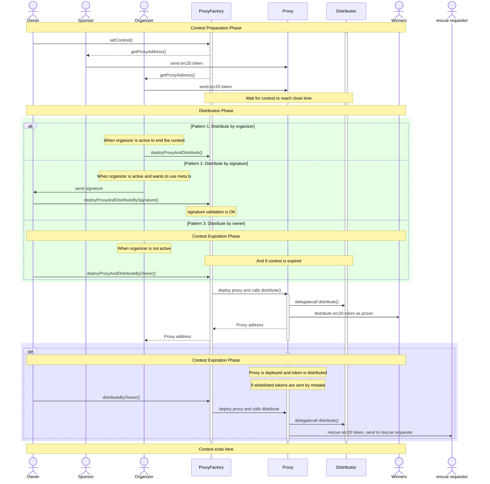

# Contest Details

<br/>
<p align="center">

</p>
<br/>

# Contest Details

## Contest Details 

- Total Prize Pool: $15,000
  - HM Awards: $14,000
  - Low Awards: $1,000
  - No GAS, Informational, or QAs
- Starts August 21, 2023
- Ends August 28th, 2023

## Stats
- nSLOC: ~194
- Complexity Score: ~213
- Dollars per Complexity: ~$70

# About the Project

- [Landing Page](https://sparkn.io/)
- [CodeFox Twitter](https://twitter.com/CodeFoxInc)
- [Sparkn Twitter](https://twitter.com/sparkn_io)

# Sparkn

## Incentive

Nowadays information is spread around the world in an incredible speed. However, in some isolated areas the information gaps are too substantial to overcome the challenges. One of the biggest challenges we noticed so far is: neither there are talented people nor incentives to create great ideas in some of these areas.

We found that there are many problems can be solved by the community in a more innovative and open way if things are done openly and smartly with adequate incentives.

Since its inception, Web3, or we can all it "blockchain industry", has been thriving, thanks in part to its inherent incentive structure. We believe that the underlying philosophy and values of Web3 can be applied more widely to address various problems.

Our belief is that the more problems we can solve using this technology, the more value we can generate. This, in turn, will allow more people to reap the benefits of Web3 and blockchain. Ultimately, this could lead to the widespread adoption of Web3, allowing it to become a mainstream technology

Because of this, we have created **SPARKN**.

# What is SPARKN

SPARKN protocol is a Web3 project that aspires to create a marketplace for anyone looking to find solutions to their problems or eager to assist others in solving theirs.

As an initial step, we've developed the protocol without any limitations. The manner in which the protocol is used is entirely at the discretion of the users, allowing them to adapt it to their unique needs and preferences.

## Scope

-   src/
    -   ProxyFactory.sol
    -   Distributor.sol
    -   Proxy.sol

## Out of Scope

Any file except for the files in the above Scope.

## Contracts

The contracts in this repository are used as escrows for SPARKN users' assets on-chain.
Our goal is to make sure assets on SPARKN are safe and transparent, no matter who is using it.

These contracts are responsible for the escrowing of users' funds and distributing them to the winners of the contests. We tried to keep things simple and safe.

All the contracts are sitting in the `src/` folder. These are the core contracts of the protocol.

The contracts are supposed to be deployed to any EVM-compatible chains.

# Roles

There are mainly 3 roles in the protocol. Another role is the owner.

-   Organizer: The person who creates the contest and he is responsible for distributing the prizes to the winners. We also sometimes call this role "innovator".
-   Sponsor: the person who is willing to fund the contest. Sponsor can be anyone include the organizer.
-   Supporter: the person who is willing to help solve the problem. Winners are selected from the supporters.
-   Owner: The administrator of the protocol.

The graph below shows the structure of the contracts and their relationships in the protocol.


### More Context

-   The contracts is created with the philosophy of "supporter first".

If a contest is created and funded, there is no way to refund. All the funds belong to the persons who wants to help solve the problem, we call them "supporters". And there is a certain assets-locking period of time in which no one except the organizer can call and distribute the funds to the winners.

-   SPARKN protocol consists of both web2 and Web3, and the system can be upgraded in the future. Because the structure of the contracts are simple and straightforward, and at the same time, all contests have their own life cycle, it is easy to upgrade the system in the future. Once a contest's life cycle ends, we can decide to introduce new contests with any necessary upgrades from that point on.

#### `ProxyFactory.sol`

This is the main entry point of the protocol.

It has several functions.

-   The owner can use it to set new contests.
-   The organizer can use it to deploy proxy and distribute prizes to winners.
-   The organizer can use meta transaction to send signature to someone else to deploy proxy and distribute prizes to winners.
-   The owner can deploy proxy and distribute prizes to winners if organizer did not call the function in time.
-   The owner can distribute the tokens stuck in the proxy after the proxy's expiration.
-   Anyone can call `getProxyAddress()` to get the address of the proxy even before its deployment.
-   It contains a whitelist.

This contract inherits the `Ownable` contract from OpenZeppelin for access control. And it inherits the `EIP712` contract from OpenZeppelin for meta transaction. `_hashTypedDataV4` is used for function `deployProxyAndDistributeBySignature()`.

#### `Distributor.sol`

This is a contract used as the logic contract of the proxy. It will not be used as a single contract, but it will be called through proxy as delegate calls.

Its functions are as follows:

-   Only the proxy factory can call the `distribute` function to distribute prizes to winners.
-   During the distribution of prizes, a certain portion of the token in the proxy contract will be sent to the stadium address as fee.
-   During the calls, it will check the whitelist in the factory contract.

#### `Proxy.sol`

This is a proxy contract. It will be deployed by the factory contract. This contract is paired with every single contest in the protocol.

-   It is designed with minimal logic in it.
-   All the calls to proxy contract will be delegated to the implementation(distributor) contract.

## Tests

Tests are in the `test/` folder. More explanations about test cases can be found in the test folder's [`README.md`](https://github.com/codefox-inc/sparkn-contracts/tree/main/test) file.

## Known Issues

These are known issues or designed by purpose.

-   There is a way to rescue the token stuck in the proxy contract after the deployment and distribution of prizes only when the token is whitelisted. If the token is not whitelisted, and then if someone sent the token by mistake, the token will be stuck there forever.
-   Proxy contracts are designed to be deployed and distribute the prizes to winners simultaneously. Before the deployment, sponsors are supposed to send the whitelisted ERC20 token to the anticipated/calculated proxy contract address. The proxy address can be calculated by the function `getProxyAddress()`.
-   Proxy contracts are supposed to be disposed after the contest is over. If there is a need to upgrade the protocol, we will just create a new implementation contract and deploy proxies with the new implementation contract. And so is the factory contract.
-   Owner is in charge of some of the key functions of the protocol. Owner's centralization risk is not an issue to be considered this time.
-   We may build a reputation system in the futue to handle the issue of the system being maliciously used, e.g., sybil attack.

## Notes

-   We have designed the protocol by using a lot of immutable variables. So it is supposed that there is no state variable collision in the system. If you find any issue, please report.
-   The reason we chosse to use the proxy and implementation pattern is because this can reduce a lot of gas with only deploying the proxy contract with minimal size for each contest.
-   Unfortunately, the current condition of Web3's scalibility is not able to support total on-chain application. That is why we created a more versatile version of it using a hybrid solution of web2 and Web3. We will try to make it more and more decentralized after we onborad more users and the condition of Web3 improves.

## Sequence Diagram of the Protocol

This sequence diagram shows how the protocol works considering the process of the contest with the roles in the protocol.



# How to Start

1. Install dependencies

```bash
forge install
```

2. Run tests

```bash
forge test
```

run a single test

```bash
forge test --mt <test_function_name>
```

run fuzz test

```bash
forge test --match-contract FuzzTestProxyFactory
```

see test coverage

```bash
forge coverage
```

3. Deploy contracts

```bash
forge deploy --network <network>
```

or deploy to local network

```bash
make deploy
```

4. Other things to do

Format the codes

```bash
make format
```

# Reference

-   [Foundry Book](https://book.getfoundry.sh/)
-   [OpenZeppelin](https://docs.openzeppelin.com/contracts/4.x/)
